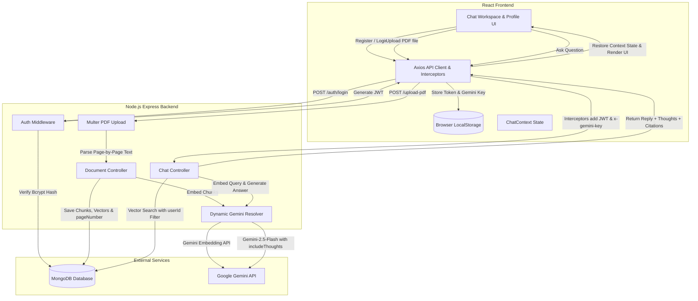

# AI PDF RAG Chatbot - Premium Architecture & Features

This repository contains the client-side code for a secure, responsive, and feature-rich **Retrieval-Augmented Generation (RAG)** chatbot. Users can register accounts, upload multi-page PDFs, chat with individual documents, inspect model reasoning steps, copy chunk sources, and configure custom API keys to bypass rate limits.

---

## 📊 System Architecture & Data Flow



---

## 🚀 Key Features

### 1. 🔐 Multi-User Isolation & JWT Authentication
* **Security Layer**: Protects all pages using custom `<ProtectedRoute>` wrappers.
* **Database Isolation**: Documents, vector embeddings, and conversations are strictly isolated using `userId` keys. User A cannot view, query, or search User B's documents or chat histories.
* **JWT Interceptor**: Client-side API calls automatically append `Authorization: Bearer <token>` headers via Axios interceptors.

### 2. 🗂️ Document-Scoped Conversation Persistence
* **State Persistence**: A global React Context (`ChatContext`) manages in-memory states so that switching between the **Chat Workspace** and the **Profile Page** preserves all active chat history.
* **Independent Threads**: Swapping between different PDF files dynamically restores that specific document's chat history without erasing or mixing conversations.
* **Purge on Logout**: Logging out triggers `clearChatState()` which completely purges message logs and file structures from memory to prevent cross-account leaks.

### 3. 📄 Page-Level Visual Citations
* **Page Ingestion**: The ingestion pipeline parses PDFs page-by-page, chunking each page's text independently and saving the corresponding `pageNumber` alongside vector embeddings in MongoDB.
* **Interactive Citations**: Source chunks matching the query are rendered as glassmorphic `.source-card` elements in a responsive grid.
* **Citations Badge & Copy Action**: Displays `📄 Page X` (or `📄 Source #Y` fallback) and features a `📋 Copy` button which changes to `✓ Copied` for clean micro-interaction feedback.

### 4. 🤔 Model Reasoning & Thinking Process UI
* **Dynamic Configuration**: Backend endpoints query Gemini with `includeThoughts: true` enabled.
* **Active Loading State**: While the response is generating, the interface renders a loading bubble next to an active thinking box showing `Thinking about query and context...` with a loader spinner.
* **Collapsible Accordion**: Once complete, thoughts are formatted inside a collapsible `🤔 Show Thinking Process` accordion below the AI response bubble.

### 5. 🔑 Custom Gemini API Key Bypass
* **Privacy-First Storage**: Users can configure their own Gemini API key on their Profile page. The key is stored purely in browser `localStorage` and is never saved on the server database.
* **Dynamic Resolver**: All API calls intercept and attach the key via the `x-gemini-key` header. The backend dynamically instantiates a client instance using the user's key, falling back to the server key if absent.

---

## 🔌 API Reference & Client Interceptors

### 1. Interceptors (`src/api.js`)
Axios automatically intercepts outgoing requests to inject credentials:
```javascript
const token = localStorage.getItem("token");
if (token) {
  config.headers.Authorization = `Bearer ${token}`;
}

const geminiKey = localStorage.getItem("gemini_api_key");
if (geminiKey) {
  config.headers["x-gemini-key"] = geminiKey;
}
```

### 2. Endpoint Specification

#### A. Document Management
* **Upload PDF** (`POST /upload-pdf`): Uploads PDF multipart form data. Processes page-by-page text, generates vector embeddings, and saves to MongoDB.
* **Fetch Documents** (`GET /documents`): Retrieves all documents owned by the authenticated user.
* **Delete Document** (`DELETE /documents/:id`): Deletes document metadata and all corresponding vector embeddings.

#### B. Conversational & Querying
* **Ask PDF (RAG)** (`POST /ask-pdf`):
  * **Payload**: `{ question: string, documentId: string }`
  * **Response**: Returns the RAG-generated `answer`, model `thought` steps, and `matchedChunks` containing source `text` and `pageNumber`.
* **General Chat** (`POST /chat`):
  * **Payload**: `{ messages: Array }`
  * **Response**: Returns the LLM `reply` and `thought` steps.

---

## 🛠️ Installation & Development

1. **Install Dependencies**:
   ```bash
   npm install
   ```
2. **Environment Variables**:
   Create a `.env` file in the root of the client folder:
   ```env
   VITE_API_URL=http://localhost:5000
   ```
3. **Run Locally**:
   ```bash
   npm run dev
   ```
4. **Compile Production Bundle**:
   ```bash
   npm run build
   ```
